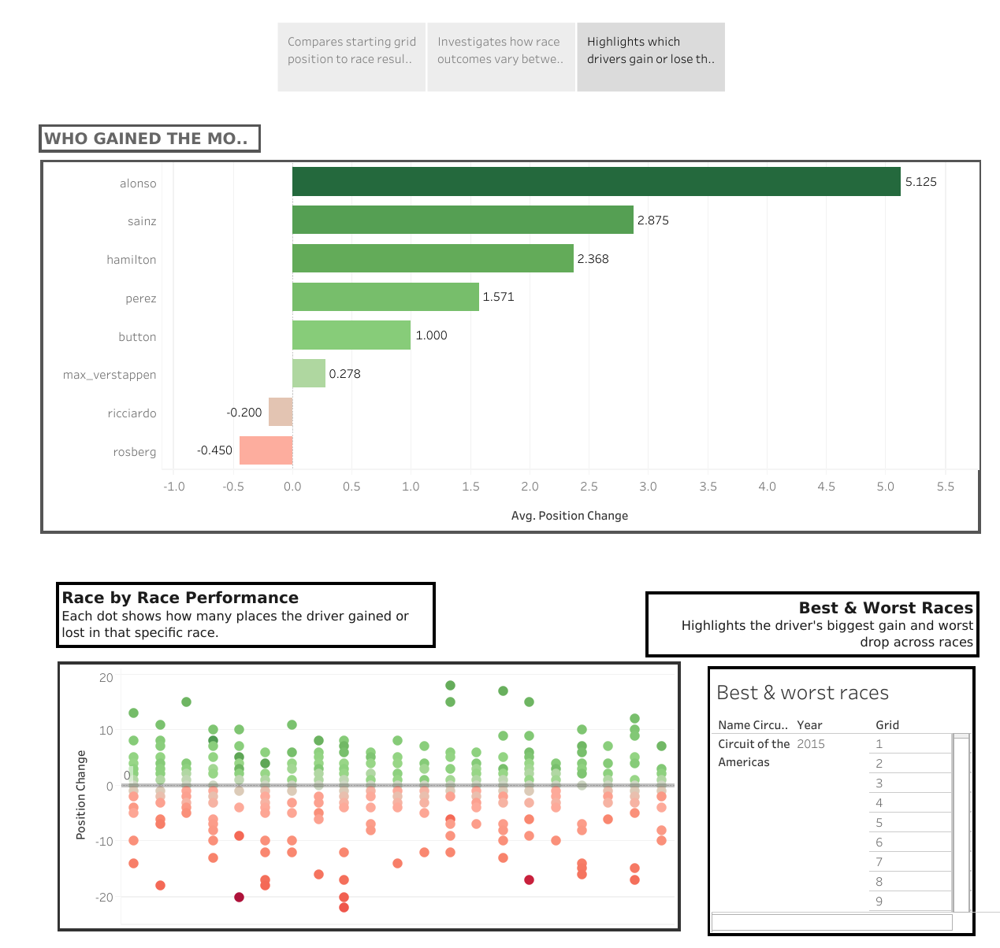

# 🏎️ Formula 1 Race Intelligence & Strategy AI
**An End-to-End Predictive Pipeline: From Historical Diagnostics to Real-Time Simulation.**

[](https://f1-predictive-ai.streamlit.app/)
[](https://public.tableau.com/views/F1RaceIntelligenceExploratoryAnalysisforPredictiveModeling/GridPositionvsResults)

## 📌 Project Overview
Developed as part of my Computer Science Engineering curriculum, this project bridges the gap between historical sports analytics and predictive machine learning. By analyzing over 70 years of Formula 1 data, I built a system that identifies performance drivers and forecasts race outcomes using an optimized **Random Forest** architecture.

### Core Components:
* **Diagnostic Layer (Tableau):** Analysis of technical regulation impacts (2017–2024) and vehicle reliability trends.
* **Exploratory Analysis (Jupyter):** Statistical deep-dive into feature correlations and data engineering.
* **Predictive Engine (Python/ML):** Multi-output modeling for podium probability and finishing positions.
* **Web Deployment (Streamlit):** Interactive "What-If" simulation dashboard for real-time race forecasting.

---

## 📊 Phase 1: Diagnostic Analytics (Tableau)
I utilized Tableau to perform a diagnostic analysis of race dynamics, focusing on the correlation between starting position and final result, the overtaking potential of different circuit types, and individual driver "racecraft" (ability to gain positions through the field).
| 1. Grid Position vs Results | 2. Positional Variance across Circuits | 3. Driver Position Gains |
| :---: | :---: | :---: |
|  |  |  |
| *Quantifying grid advantage and its significant variation across track types (e.g., Street vs. High-Speed).* | *Analyzing overtaking difficulty by measuring positional variance at specific venues (e.g., Monaco vs. Monza).* | *Ranking drivers by average positions gained to identify strong racecraft independent of qualifying pace.* |
---

## 🤖 Phase 2: Predictive Modeling & Optimization
The predictive engine uses a leakage-free pipeline with advanced feature engineering to prioritize "momentum" and track-specific expertise.

### Final Model Performance (Test Data: 2023–2024):
| Metric | Value | Technical Context |
| :--- | :--- | :--- |
| **Podium Accuracy** | **87.92%** | High overall classification success. |
| **Podium Precision** | **0.64** | 64% reliability in podium forecasts. |
| **Podium Recall** | **0.46** | Identifying 46% of true podium finishes. |
| **Test Error (MAE)** | **3.94** | Positions average error per driver. |

**Key Driver:** Feature Importance analysis reveals **Driver Track History (61.5%)** as the dominant predictor.

---

## 🛠️ Tech Stack & Structure
* **Data Science:** Python (Pandas, Scikit-Learn, Joblib)
* **Visualization:** Plotly Express, Tableau Public
* **Engineering:** Hyperparameter Tuning (GridSearchCV), Cross-Validation

```text
├── app.py                # Live Streamlit Application
├── requirements.txt      # Dependency Management
├── models/               # Optimized Estimators & Lookup Data
├── scripts/              
│   ├── processing/       # Data cleaning and merging scripts
│   └── train_models.py   # Main Training Pipeline
├── notebooks/            # EDA & Experimental Code (.ipynb)
└── visuals/              # Tableau Workbooks & Static Plots
```
## 🚦 Setup & Reproducibility
To run this project locally, follow these steps to initialize the data pipeline:

1. **Clone the repo:**
   ```bash
   git clone [https://github.com/Abimanyu-KA/f1-predictive-analytics-strategy-ai.git](https://github.com/Abimanyu-KA/f1-predictive-analytics-strategy-ai.git)
   cd f1-predictive-analytics-strategy-ai

2. **Install Dependencies**
  ```bash
  pip install -r requirements.txt
```
3. **Data Acquisition**

  - Download the **Kaggle F1 Dataset**:  
    https://www.kaggle.com/datasets/rohanrao/formula-1-world-championship-1950-2020
  
  - Create a folder: `data/raw/` at the root of the project.
  - Place all downloaded `.csv` files inside `data/raw/`.

4. **Run the Pipeline**

  - **Step A (Process):**  
    Run all scripts in `scripts/processing/` sequentially to clean and engineer features.
  
  - **Step B (Train):**  
    Run the following command to generate the optimized `.joblib` estimators:
  
    ```bash
    python scripts/train_models.py

5. **Launch App**

  ```bash
  streamlit run app.py
```
---
